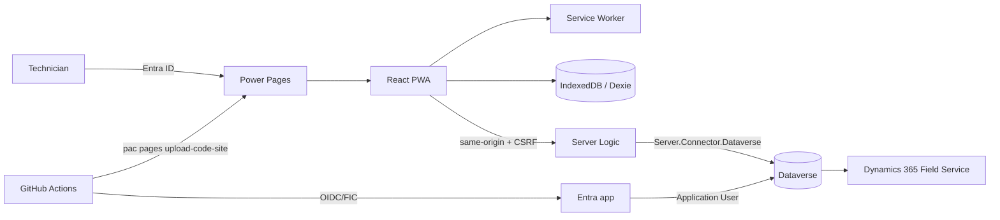

# Architecture

## Goal

Provide an installable offline-first application for field workers while keeping the public/browser surface small and using Power Pages as the hosting and authenticated server boundary.

## Components

## Trust boundaries

The browser is untrusted. Client-side validation improves UX but is not authorization. Server Logic must validate inputs, constrain operations, and rely on the Power Pages Web Role/Table Permission model.

IndexedDB is a local working cache, not a security boundary. Do not store client secrets, long-lived access tokens or data the signed-in user is not authorized to access.

## Source of truth

- `src/frontend`: human-maintained React/TypeScript source.
- `src/backend`: human-maintained Server Logic JavaScript source.
- `.powerpages-site/server-logic`: deployable snapshot expected by Power Pages code-site tooling.
- `dist`: generated frontend output; not committed.
- `scripts/sync-server-logic.mjs`: copies backend source to the deployment snapshot.

## Deployment unit

Frontend and Server Logic are released as one Code Site artifact. CI may validate frontend/backend independently, but CD uploads the complete site so API and UI versions remain aligned.

## Deliberate non-goals

This starter does not attempt to recreate the Dynamics 365 Field Service mobile client. It provides an application-specific façade and offline model that should be expanded only for required business operations.
